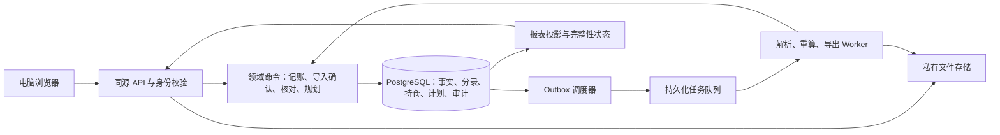

# Wealth 技术选型与架构决策

版本：0.1 · 2026-09-16 · 状态：开发设计基线；未安装应用依赖、未运行开源候选，也未实现本系统。

## 1. 决策摘要

建议采用 **React + TypeScript 电脑网页端，Django + Django REST Framework 后端，PostgreSQL 数据库，模块化单体架构**。一个后端维护唯一财务事实，网页、导入、定时任务都调用同一套领域规则。

这不是因为现有项目“没有功能”。[源码审计](research/open-source-fit.md)确认 Sure 已有可复用的多家庭、账户、收支和任务体系；Wealthfolio 有较完整的投资分析。但本项目最关键的多源凭证归并、按币种平衡与冲正、QDII 确认生命周期、快照覆盖规则，需要贯穿导入到报表。当前建议围绕这些规则自建，避免同时维护两套可修改余额的系统。

选择状态为“建议采纳，G0 验证后锁定”。自建的开发成本和维护责任由本项目承担，不能声称一定比 fork 便宜。G0 用同一组金标准案例对照 Sure：如果能保留现有导入、账务与报表主流程，并通过权限、重复导入、撤销、基金在途的关键验证，且实现估算明显更低，则更新本决策改用 Sure 的 Rails 技术栈；不另接一套 Django 账本。此条件是可推翻当前建议的证据门槛，不是并行开发两个完整产品。

## 2. 开源方案决策

| 方案 | 实际价值 | 当前取舍 |
| --- | --- | --- |
| Wealthfolio 插件／fork | 投资页面、收益模型、活动模型可参考 | 当前 Web 共享账本缺少家庭作用域；多租户改动跨认证、查询、任务和数据层，不作为主底座 |
| Sure fork | 真实家庭模型、账户权限、收支、导入、后台任务 | 唯一保留的整系统 fork 候选；需要验证来源归并、冲正、投资和跨入口权限 |
| 自建模块化单体 | 可以统一证据、账本、计划与租户模型 | 当前设计基线；代价是完整建设产品流程和运维 |
| 多个财务系统拼接 | 可分别获得记账与投资界面 | 首版不采用；身份、账户、金额和更正同步会增加一致性成本 |

可学习开源数据结构、交互与公开算法；实际复制代码先记录文件、版本、许可证与义务。AGPL 项目的代码不能因放入新仓库而改变许可。不开箱即用、不开源许可未经选择、也未获得商业闭源许可，是不同问题。[审计中的固定版本和许可证链接](research/open-source-fit.md#2-证据口径与版本)是复用记录的起点。

## 3. 技术组合

| 层次 | 首选 | 选择原因与限制 |
| --- | --- | --- |
| 前端 | React 19 系列、TypeScript、Vite、Ant Design | 适合中文表格、筛选、表单、导入向导；登录后的桌面应用不需要为搜索引擎增加服务端渲染 |
| 页面与数据 | React Router、TanStack Query | 页面导航、请求状态和刷新；服务器是财务数据权威，前端缓存带空间与数据版本 |
| 图表 | Apache ECharts | 资产趋势、现金流、币种分布；图表使用同一报表接口，不另算账 |
| 服务端 | Python 3.13、Django 5.2 LTS、DRF 3.16 系列 | 认证、会话、迁移、事务、后台管理和十进制处理基础成熟；租户隔离、业务权限和核算仍需自行实现 |
| 数据库 | PostgreSQL 18，当前受支持补丁 | 精确 NUMERIC、约束、事务、行锁、RLS；开发和集成测试也使用 PostgreSQL，避免 SQLite 差异 |
| 异步处理 | Celery 5.6 系列 + RabbitMQ | 文件解析、重算、导出、周期扫描；业务任务状态保存在 PostgreSQL，不依赖队列作账本 |
| 文件 | 私有存储接口，开发用受控本地目录，部署用私有对象存储 | 原始账单、导出及备份不与网页公开文件混放；具体托管服务商待部署选择 |
| API 文档 | OpenAPI，drf-spectacular 生成 | 用契约生成前端类型；DRF 内置 schema 生成已弃用，不新增依赖它的实现 |
| 测试 | pytest / pytest-django、属性测试、Playwright | 重点验证核算不变量、并发幂等、权限和端到端导入，不用截图代替金额验证 |
| 打包运维 | 容器镜像、Compose 起步、TLS 入口、CI | 同一后端镜像运行 API／worker／scheduler；先建立可重复部署与恢复 |

这是一组兼容性候选，不是已经生成的锁文件。G0 固定完整依赖、镜像摘要和浏览器版本，运行迁移及最小集成测试；以后补丁升级也走回归。Node 24 LTS 用于前端构建。Django 5.2 选择的是仍受支持的 LTS，而非最新主版本；官方列出的扩展支持截止为 2028 年 4 月。[Django 支持表](https://www.djangoproject.com/download/)、[DRF 3.16 兼容性](https://www.django-rest-framework.org/community/3.16-announcement/)、[PostgreSQL 支持表](https://www.postgresql.org/support/versioning/)、[Node 发布状态](https://nodejs.org/en/about/previous-releases)。

React/Vite、组件库和图表的官方入口：[React](https://react.dev/learn/build-a-react-app-from-scratch)、[Vite](https://vite.dev/guide/)、[Ant Design](https://ant.design/docs/react/introduce/)、[ECharts](https://echarts.apache.org/en/index.html)。表内选型是本项目判断，不代表这些项目已通过本项目验收。

## 4. 架构与模块边界

| 模块 | 负责 | 不负责 |
| --- | --- | --- |
| identity / workspaces | 登录、邀请、成员、角色和空间上下文 | 解释交易金额 |
| evidence / imports | 原文件、来源记录、解析、映射、匹配和批次 | 解析过程中直接改正式余额 |
| ledger | 经济事项、分录、清算／在途、冲正与账期版本 | 预测未来收入 |
| investments | 产品、订单、持仓、成本、估值、收益及机构结算 | 自行推断未知期货保证金公式 |
| planning | 定投、目标、资金预留、贷款及逐期计划 | 发起真实付款或成交 |
| reconciliation / reporting | 对账、覆盖选择、历史投影、汇率折算和指标解释 | 隐藏未解释差额 |
| jobs / audit / storage | 可靠任务、审计、文件访问与保留 | 绕过租户或成员权限 |

模块可以在同一数据库事务内调用；不为每个模块新增网络服务。原始证据、已确认事项及其分录为事实来源；余额、持仓汇总、趋势是可重算投影。采用有版本的事实与冲正，不要求首版实现完整事件溯源框架。

建议未来目录为 `frontend/`、`backend/`、`infra/`、`docs/`、`tests/fixtures/synthetic/`；本轮仅创建文档。真实账单和脱敏私有样本均不默认提交到代码仓库。

## 5. 多家庭隔离与登录

1. **应用层先验证身份与 Membership，再建立当前空间上下文。** URL 的空间 ID 和客户端传来的 tenant_id 不能直接构成授权。资源 ID 必须在已授权空间内查询；跨空间引用不能通过创建或修改绕过检查。
2. **数据库 RLS 作第二层防线。** 私有业务表使用 tenant_id，运行角色不为表所有者、不带 BYPASSRLS；启用并按需 FORCE RLS，迁移角色单独管理。通过事务局部配置传递已验证空间；未设置上下文时默认拒绝。连接池复用、后台任务和管理查询也要测试。RLS 对超级用户等有例外，不能把“开启 RLS”当作安全验收。[官方 RLS 说明](https://www.postgresql.org/docs/current/ddl-rowsecurity.html)。
3. 关键关系使用 `(tenant_id, id)` 组合唯一键及带租户的外键／相应数据库约束，防止 A 空间分录指向 B 空间账户；ORM 不支持直接表达的约束用可审查的迁移补齐。全局证券代码等参考数据与家庭自定义数据分表或明确权限。
4. 文件、导出、任务、缓存、报表投影均按空间隔离。导出提交及下载时再次检查 Owner 权限，撤销成员后不可取回仍在生成的结果。
5. 登录采用服务端会话、Secure/HttpOnly/SameSite cookie、CSRF 防护和同源部署。所有 API 默认要求登录；密码处理使用框架能力，登录限速和角色权限明确补建。Django 自带认证不包含完整的对象级授权和登录限速。[官方认证边界](https://docs.djangoproject.com/en/5.2/topics/auth/)。
6. DRF 的对象权限检查不自动替代列表过滤或创建时的关联检查；统一实现 scoped queryset 与命令授权，并验证所有入口。[DRF 权限说明](https://www.django-rest-framework.org/api-guide/permissions/)。

空间 Owner、Editor、Viewer 的范围以 [FR-01](product-requirements.md#fr-01-账簿空间与成员) 为准。框架管理员不自动成为所有家庭成员；日常后台不展示财务明细。首版拟用邀请加入，邀请过期、撤销、最后一个 Owner 保留、密码重置和会话失效均纳入 G1。

## 6. 金额、事务与数据版本

- 金额、份额、价格和汇率使用 Python Decimal 和 PostgreSQL NUMERIC。初始建议金额 `NUMERIC(38,12)`，数量／价格／汇率 `NUMERIC(38,18)`，与领域模型一致；G0 用真实来源最大值／小数位验证后固定，不静默截断超范围数据。业务展示按币种、字段和机构规则取精度，不能所有字段都保留两位。
- 核算服务显式设置 Decimal 运算上下文，不能依赖默认 28 位有效数字。拟以 160 位有效数字处理有界中间量，再在规则规定的位置量化；G0 验证最大数量 × 价格 × 汇率、累计加总和超范围拒绝，确定上下文及舍入策略。十进制从原始字符串构造，禁止先经过 float。收益率数值求解单独规定算法、定义域及误差，不把迭代近似值当作金额事实。
- JSON 传输十进制字符串，如 `"1234.5600"`。拒绝非有限值；前端负责格式化和校验提示，正式记账结果由后端返回。图表转换数值仅用于绘制，不回写金额。Python Decimal 与 PostgreSQL numeric 的设计依据见[官方 Decimal](https://docs.python.org/3/library/decimal.html)和[官方数值类型](https://www.postgresql.org/docs/current/datatype-numeric.html)。
- 一次实际事件的分录、持仓事件、证据关联、版本和 outbox 在同一事务内提交。以事件为单位按币种借贷平衡；跨币种用显式桥接科目。应用先校验，数据库提交入口／延迟约束再保护，不依靠仅能检查单行的 CHECK 来校验跨行合计。
- 并发写同账户、产品或计划项时，使用稳定顺序的行锁、唯一约束和版本检查；数据库死锁可有界重试。不能只在页面禁用按钮来防重复。
- 已确认事项不能直接修改成另一笔而不留痕；更正创建冲正／替代关系，并使相关估值、收益和核对结论失效。重算读取明确账本修订号，旧任务不得覆盖新修订的投影。
- 开启或修改本位币不改原币事实；首版空间有正式账目后默认禁止原地改本位币，另币种展示走报表参数。如要变更会计本位币，作为显式迁移另行设计。

数据库事务仅能保证本库原子性，不能保证外部消息一定投递；因此在同一事务中写 outbox，后台投递失败后重试。[Django 事务与提交回调](https://docs.djangoproject.com/en/5.2/topics/db/transactions/)说明了事务和 `on_commit` 的边界；outbox 是本项目据此作出的可靠性设计。

## 7. 后台任务与每月还款

任务采用“允许重复投递，业务结果幂等”，不声称队列恰好执行一次。Celery 用受限任务类型、超时、重试上限、失败原因和管理员重试；消息只携带内部 ID，Worker 从数据库重新获取授权范围及当前事实。[Celery 任务说明](https://docs.celeryq.dev/en/stable/userguide/tasks.html)、[官方队列支持表](https://docs.celeryq.dev/en/stable/getting-started/backends-and-brokers/index.html)。

单个周期扫描器按空间时区生成到期项，数据库唯一键为 `(tenant_id, plan_id, installment_id)`。修改计划保留已有期次身份，仅替换未来未发生计划；周期扫描器即使重复启动也不能重复生成实际交易。停机后按上次扫描点补生成待处理项，账单先导入、人工先确认也通过同一期次关联去重。周期任务有重叠风险，需数据库锁和唯一约束兜底。[Celery 周期任务说明](https://docs.celeryq.dev/en/stable/userguide/periodic-tasks.html)。

到期项只改变待办与预测。已证实银行扣款但缺本金／利息拆分时，账本先确认现金减少与“还款待分配清算”，相关净资产／负债／费用显示不完整；拆分证据到达后，在同一生命周期追加清算事件，不再次扣现金。数据齐全时可一次确认。用户关闭网页不影响服务器扫描，但服务器停机不意味着银行停扣或付款成功。

## 8. API 约定与第一批契约

统一前缀 `/api/v1/spaces/{space_id}`。ID 不具有权限意义；列表使用游标分页和显式筛选，结果带 `data_revision`、`as_of`、`completeness`，金额始终附币种。OpenAPI 用 [drf-spectacular 路线](https://www.django-rest-framework.org/api-guide/schemas/)生成并纳入契约检查。

| 资源／命令 | 方法示意 | 关键约束 |
| --- | --- | --- |
| 账户与期初 | `GET/POST /accounts`、`POST /opening-balances` | 原币、多币子余额和来源，期初不算收入 |
| 上传与解析 | `POST /imports`、`GET /imports/{id}` | 文件限制、来源、私有对象、异步状态；不提交财务事实 |
| 映射与预览 | `PUT /imports/{id}/mapping`、`GET /imports/{id}/preview` | 包含映射版本、账本版本、冲突和预览摘要 |
| 确认／冲正 | `POST /imports/{id}/commit`、`POST /imports/{id}/reverse` | 确认匹配版本、幂等键、依赖检查、一次事务 |
| 实际事项 | `POST /events`、`POST /events/{id}/correct` | 按事项类型收字段；由领域规则生成分录，不让普通用户拼任意不平衡分录 |
| 投资 | `GET /positions`、`GET /performance`、`POST /valuations` | 范围、方法、价格／汇率时间与数据缺口 |
| 规划 | `/goals`、`/scenarios`、`/loans`、`/installments` | 场景与正式账本分离；确认期次命令可关联已有事件 |
| 对账 | `POST /reconciliations`、`GET /reconciliations/{id}` | 同范围、币种、时点及口径；差异不得自动调平 |
| 导出 | `POST /exports`、`GET /exports/{id}/download` | Owner 权限，生成与下载双重校验 |

入账类 POST 携带 `Idempotency-Key`，按空间、调用者和命令作用域登记；相同键及相同请求返回原结果，不同请求复用同键返回 409。账本来源身份另有永久唯一约束，不能因 HTTP 幂等记录过期而允许重记。更改携带版本或 `If-Match`；预览过期／并发修改返回 409 或 412，并提供刷新方式。

错误统一返回 `code`、中文 `message`、字段错误、可重试状态和脱敏 `request_id`。未登录 401；无角色权限 403；跨空间对象统一按不存在处理；无效业务数据 422。整批失败时不返回误导性的部分成功金额。详细规范化字段见[导入契约](import-reconciliation.md)。

## 9. 部署、恢复与运行边界

首版建议邀请制集中部署，环境分为本地开发、脱敏测试、正式使用；部署地点和预算还未由用户确定。开发用合成数据，真实数据只能进入经授权环境。选择国内或境外托管前确认访问、数据保留、服务商条款和实际用户范围，不在本轮购买服务或发布网站。

初始可用一套容器部署承载网页/API、Worker、单调度器、数据库、消息队列和文件接口；这只是拓扑，不能据此承诺容量。数据库和队列不直接开放公网，凭证由运行环境注入，上传文件限制大小、解压规模、编码和处理时间，导出表格防公式注入。

监控覆盖失败导入、重复冲突、重算积压、过期行情、未投递 outbox、到期扫描滞后和备份结果；不采集账单正文。每天加密备份数据库和私有文件，密钥与备份分离管理。只有在干净环境做过恢复、对账和任务幂等演练，才验收 RPO 24 小时／RTO 4 小时目标。迁移前备份，先兼容扩展再切换读取，涉及已入账数据的迁移必须有核对与恢复路径。

首版不引入 Kubernetes、微服务、全局搜索引擎或独立分析数据库。需要额外缓存或扩容时先以基准结果判断；缓存永远可重建，不能代替账本。
